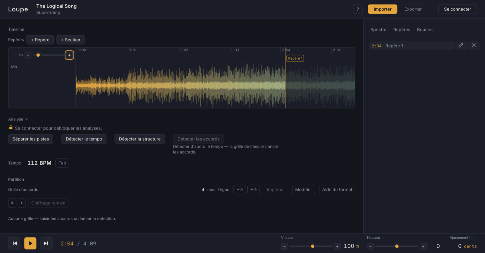
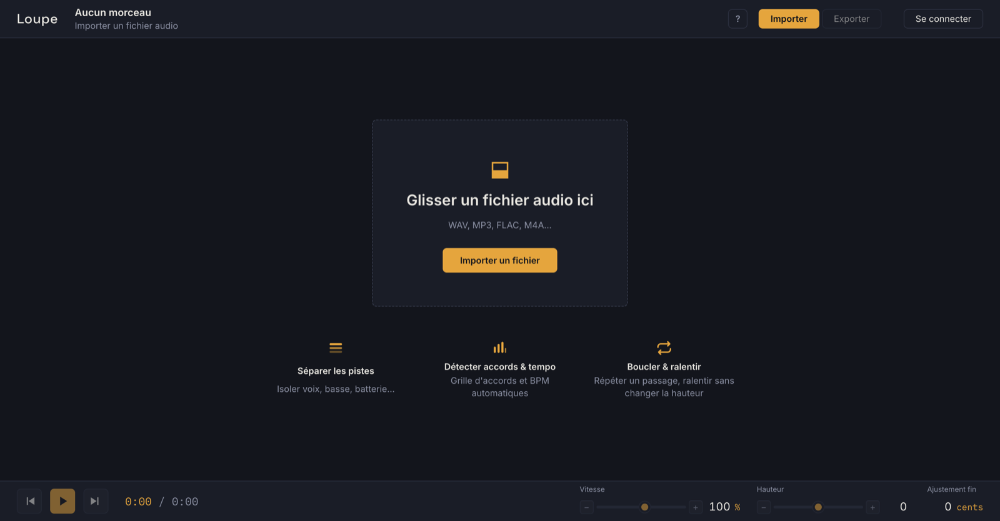
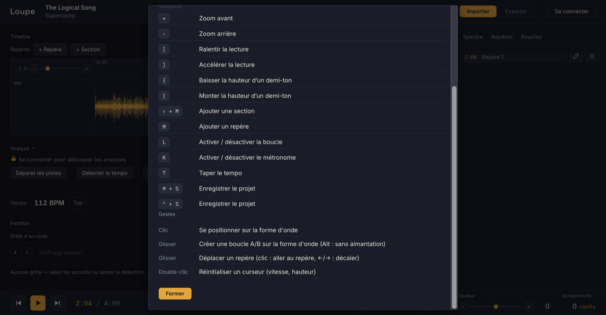

# Guide utilisateur — loupe

loupe est un atelier de travail musical dans le navigateur : importer un
morceau, le regarder, le ralentir, le boucler, en isoler les pistes, lire sa
grille d'accords — pour le déchiffrer et le répéter.



## Installer et lancer

**macOS/Linux — Homebrew (recommandé)** : aucun déblocage nécessaire,
Homebrew ne pose pas de quarantaine.

```sh
brew trust iiivan37/loupe
brew tap iiivan37/loupe && brew install loupe
```

**Téléchargement direct** : télécharger l'archive de son OS depuis la
[dernière release](https://github.com/IIIvan37/loupe/releases/latest),
vérifier son intégrité (le fichier `SHA256SUMS` est publié avec chaque
release) :

```sh
shasum -a 256 -c SHA256SUMS --ignore-missing
```

puis extraire et lancer :

- **macOS (Apple Silicon)** : `loupe-vX.Y.Z-aarch64-apple-darwin.tar.gz`.
  Le binaire n'est pas signé : macOS le bloque au premier lancement, sans
  message quand il est lancé du terminal (« clic droit → Ouvrir » ne suffit
  plus depuis macOS 15). Lever la quarantaine avant de lancer :
  `xattr -d com.apple.quarantine loupe` — ou, après un premier blocage,
  Réglages Système → Confidentialité et sécurité → « Ouvrir quand même ».
- **Linux (x64)** : `loupe-vX.Y.Z-x86_64-unknown-linux-gnu.tar.gz`, puis
  `./loupe`.
- **Windows (x64)** : le `.zip`, puis `loupe.exe` (SmartScreen :
  « Informations complémentaires → Exécuter quand même »).

Lancer `loupe` : le navigateur s'ouvre sur `http://127.0.0.1:6173`.
`loupe --port <n>` change le port, `--no-browser` n'ouvre rien. Les données
(projets, audio) vivent dans `~/.loupe`. Au démarrage, une ligne signale une
version plus récente si elle existe (pas d'auto-update ; opt-out :
`LOUPE_NO_VERSION_CHECK=1`).

## Importer un morceau

- **Fichier** : glisser un fichier audio sur la fenêtre, ou « Importer →
  Fichier… » (WAV, MP3, FLAC, M4A…).
- **Lien** : « Importer → Depuis une URL… » — YouTube et SoundCloud
  uniquement (l'audio est extrait localement par yt-dlp).



## La forme d'onde

- **Clic** : se positionner. **+ / −** : zoomer.
- **Glisser** : créer une boucle A/B, aimantée sur la grille de temps
  (maintenir **Alt** pour un placement libre).
- **← / →** : reculer/avancer d'un temps (5 s sans grille) ;
  **Shift+← / →** : d'une mesure.

## Boucler et ralentir

- **L** active/désactive la boucle A/B courante ; les boucles peuvent être
  **enregistrées, nommées** et rappelées (panneau « Boucles »).
- **Vitesse** : ralentir/accélérer la lecture **sans changer la hauteur**
  (**[** / **]** au clavier). Double-clic sur un curseur : retour à la
  valeur neutre.
- **Hauteur** : transposer l'audio par demi-tons (**{** / **}**), sans
  changer la vitesse.
- **Rampe de tempo** : sur une boucle active, monter progressivement la
  vitesse par incréments (%) à chaque passage — l'outil de répétition lente.

## Tempo, métronome, repères

- **Détecter le tempo** : l'analyse pose le BPM et la grille de temps
  (temps et premiers temps de mesure) — c'est elle qui rend la navigation
  et l'aimantation « musicales ». **T** : taper le tempo à la main.
- **K** : métronome sur la grille. Un **décompte** peut précéder le départ
  de la lecture.
- **M** : poser un repère au point de lecture ; **Shift+M** : poser un
  repère de **section** (structure). Glisser un repère pour le déplacer.

## Accords et grille

- **Détecter les accords** : la grille se cale sur les mesures et s'affiche
  en lead-sheet (déroulé et forme du morceau).
- **Modifier** : chaque accord est éditable à la main.
- **Transposer** par demi-tons (la grille suit, l'orthographe tonale reste
  juste) ; **chiffrage romain** en nommant la tonalité.
- **Imprimer** la grille (mise en page dédiée).

## Structure

- **Détecter la structure** : les sections (intro, couplet, refrain…)
  apparaissent au-dessus de la forme d'onde ; utile pour naviguer et
  boucler une section d'un clic. Les sections posées à la main (Shift+M)
  complètent la détection.

## Séparer les pistes

- **Séparer** isole jusqu'à six pistes — voix, batterie, basse, guitare,
  piano, autres — selon les instruments réellement détectés.
- Chaque piste a son **fader, mute/solo et égaliseur** dans le mixer :
  couper la basse pour la remplacer, isoler la batterie pour la travailler…
- **Exporter** : télécharger les pistes séparées en ZIP.

## Projets

- **Cmd/Ctrl+S** : enregistrer la session (morceau, boucles, repères,
  grille, mixage) comme projet ; « Enregistrer sous un autre nom » pour une
  variante. Le menu « Projets » les rouvre. Tout est stocké **en local**
  (`~/.loupe`).

## Compte et analyses

Les quatre **analyses** (tempo, accords, structure, séparation) tournent sur
un service distant GPU ; le reste de l'atelier fonctionne entièrement en
local. Elles demandent une connexion par e-mail (code à 6 chiffres) et, en
beta, un **code d'accès** ; le compteur « Analyses ce mois » est visible au
menu compte. L'audio n'est envoyé au service **que** pour ces analyses.

## Raccourcis clavier

Le récapitulatif complet vit dans l'app (« ? » dans l'en-tête) :



L'essentiel :

| Touche | Action |
| --- | --- |
| Espace | Lecture / pause |
| ← / → (+ Shift) | Reculer/avancer d'un temps (d'une mesure) |
| + / − | Zoom avant / arrière |
| [ / ] | Ralentir / accélérer la lecture |
| { / } | Baisser / monter la hauteur d'un demi-ton |
| L | Activer / désactiver la boucle |
| K | Métronome |
| T | Tap tempo |
| M / Shift+M | Repère / repère de section |
| Cmd/Ctrl+S | Enregistrer le projet |

## Un problème ?

Un bug, un blocage, une question — chaque retour compte pendant la beta :

- **[Ouvrir une issue GitHub](https://github.com/IIIvan37/loupe/issues/new)**
  (ou « Signaler un problème » dans le menu compte de l'app, qui pré-remplit
  la version), ou par mail :
  [ivan.duchauffour@gmail.com](mailto:ivan.duchauffour@gmail.com).
- Préciser l'OS, la version (`loupe --version`) et ce qui était en cours
  (import, analyse, lecture…).
